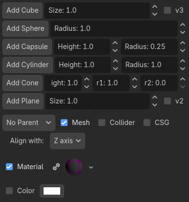

Pretty Primitive
================

Simple [Godot](https://godotengine.org) panel addon for rapid blockout
using basic boxes, spheres, cylinders, cones, capsules, and planes, together
with colliders, under a parent that can be a RigidDynamicBody3D, StaticBody3D, 
Area3D, or Node3D.

Optionally create with MeshInstance3D or CSG nodes, though CSG will
not make capsules or planes.

Simply clone this repository and copy addons/prettyprimitive to your project's
addons folder. Then activate in `Project -> Project Settings -> Plugins`.

Built for Godot 4.7.

